# TechHurts Android Widgets

A containerized Android build system producing signed APKs for six home-screen widgets under the `com.techhurts` package namespace, plus **TechHurts Widgets** — one APK containing all of them. GitHub Actions builds and publishes a release when you bump the version (or run the workflow by hand).

---

## Screenshots

Captured from a headless emulator with [`android_screen_runner`](../android_screen_runner):
`ashot run ../android_screen_runner/examples/techhurts-widgets.ts`.

| Widgets on the home screen | GOES East, live | Himawari-8, live |
|---|---|---|
| 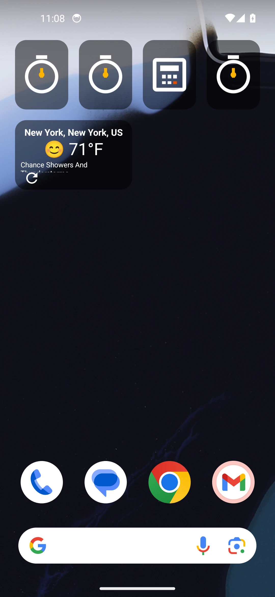 | 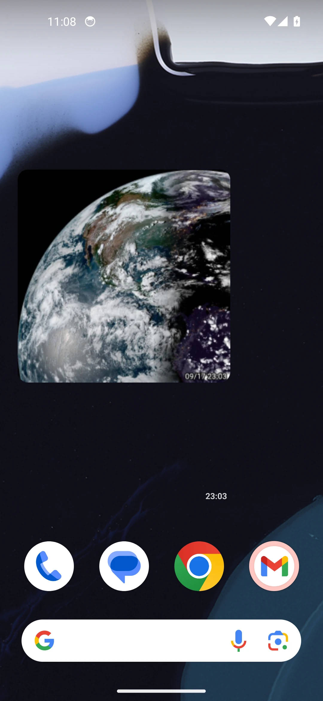 | 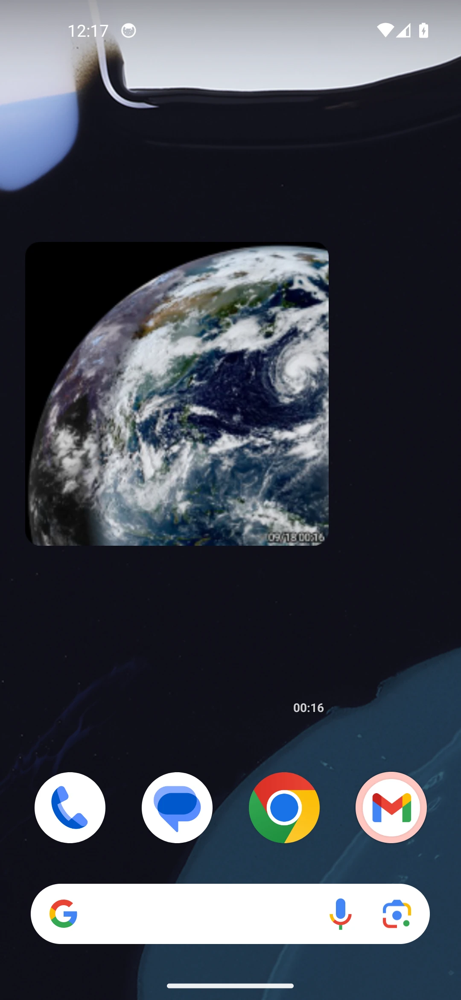 |

| Timer | Countdown | Calculator |
|---|---|---|
| 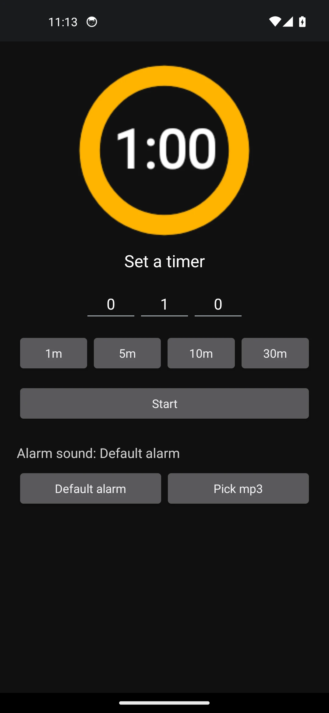 | 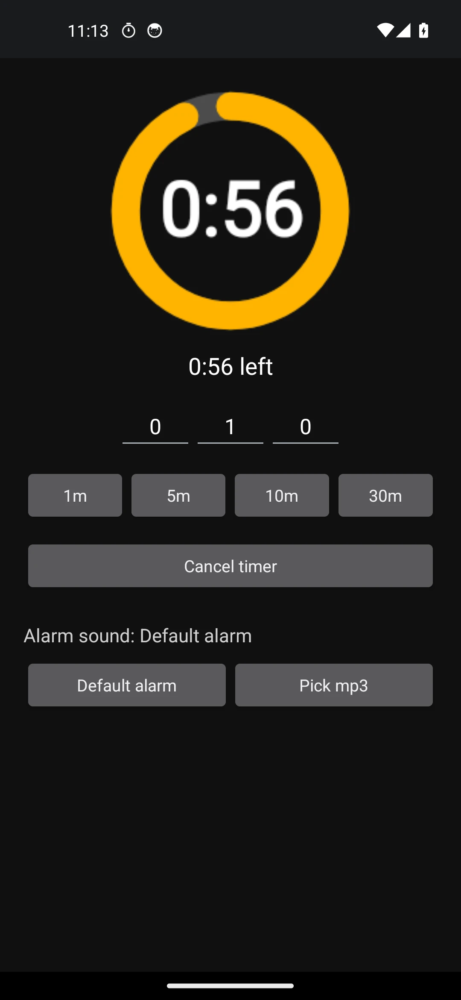 | 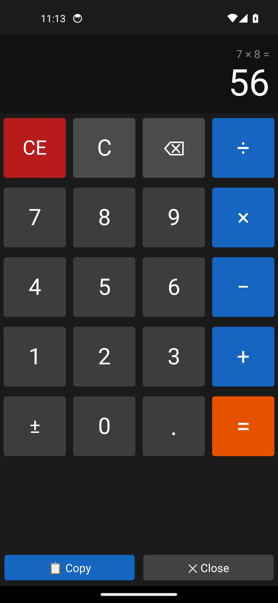 |

| Weather setup | TV remote setup | GOES East animation |
|---|---|---|
| 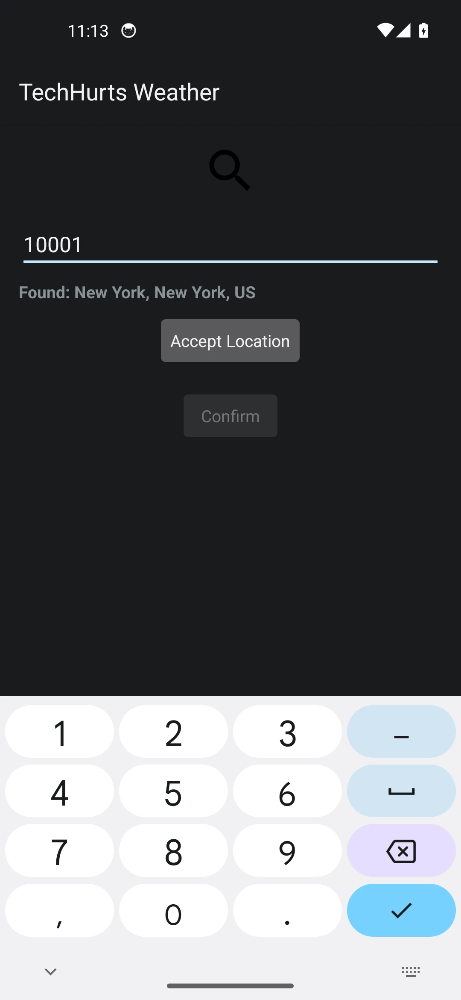 | 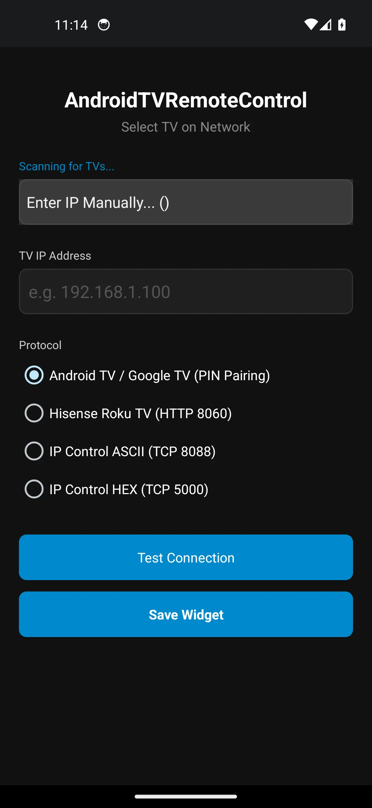 | 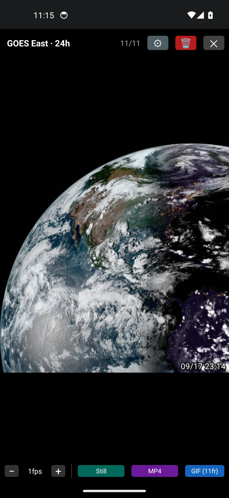 |

| Widget pack | Remote layout editor | Remote widget sizes | Share to TV |
|---|---|---|---|
| 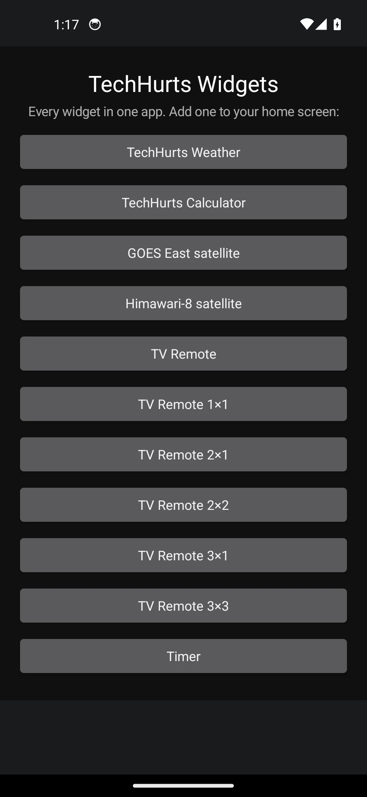 | 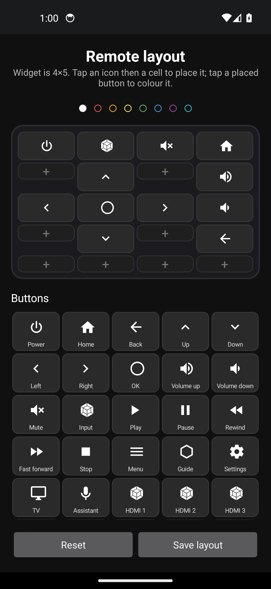 | 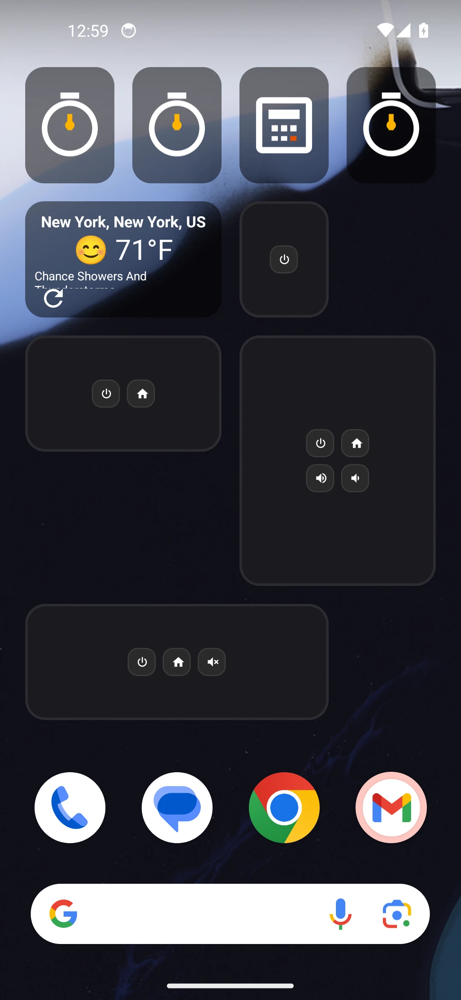 | 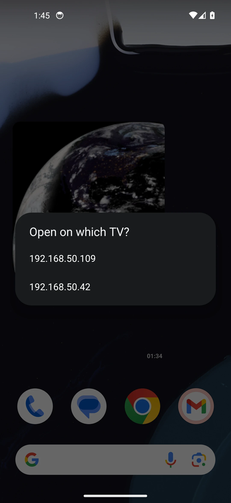 |


---

## Widgets

| Module | Package | Widget | Size |
|--------|---------|--------|------|
| `:app` | `com.techhurts.weatherwidget` | TechHurts Weather | Resizable |
| `:calculator` | `com.techhurts.calculator` | TechHurts Calc | 1×1 fixed |
| `:goeseast` | `com.techhurts.goeseast` | GOES East | 4×4 min |
| `:hisense_remote` | `com.techhurts.hisense_remote` | Hisense Remote | Resizable |
| `:timer` | `com.techhurts.timer` | TechHurts Timer | 1×1 fixed |
| `:widgets` | `com.techhurts.widgets` | **All of the above, one install** | — |

### Weather Widget
Displays current conditions and temperature from the National Weather Service (weather.gov). Tap the widget to open a full 7-day forecast screen with copy-to-clipboard. Tap the refresh icon to force an update. Configure your location by zip code on first use.

### GOES East Widget
Fetches the latest NOAA GOES-19 East GEOCOLOR full-disk satellite image every 10 minutes, crops it to focus on North America (matching the clip offsets from the companion C# tool at `~/Dev/goeseast`), and displays it in a 4×4 home-screen widget. The last 24 hours of fetched frames (~144 images) are stored in app-private storage. Tapping the widget opens a full-screen animation that plays all 24 hours of imagery in a 20-second loop (each frame shown for `20 000 ms ÷ frameCount`). Images older than 24 h are automatically pruned.

Fetching is driven by `AlarmManager` (repeating, wakeup, 10 min interval). The alarm is rescheduled automatically on device boot via `RECEIVE_BOOT_COMPLETED`. Battery optimization exemption is requested on first launch so fetching is not deferred by Doze mode.

### Calculator Widget
A 1×1 home-screen widget that shows the calculator icon until a calculation is performed, then displays the last result auto-sized to fill the cell. Tap to open the full calculator. **CE** clears the widget back to the icon; **Close** saves the last result in place.

### AndroidTVRemoteControl Widget
A resizable home-screen widget styled as a TV remote controller with support for local Wi-Fi remote control protocols. It can be configured with a custom IP address and supports four protocol modes:
- **Android TV / Google TV (PIN Pairing)**: The official Android TV Remote Protocol v2 (ports 6466/6467) using mutual TLS credentials. First-time connection triggers a pairing challenge and prompts the user to enter the PIN code displayed on the TV.
- **Hisense Roku TV (ECP)**: Simple, zero-pairing HTTP connection on port 8060.
- **IP Control ASCII**: Text-based TCP commands on port 8088 (common on B2B/Prosumer series).
- **IP Control HEX**: Binary serial command packets on port 5000 (common on commercial screens).

Buttons are laid out by dragging them into a grid (see the layout editor), in six widget sizes from 1×1 to 4×5, with a global colour and per-button overrides. Beyond key codes, buttons can launch apps (Netflix, YouTube, Plex, Disney+, Spotify, PBS Kids, Prime Video, Apple TV) or open any URL in the TV's browser, and **Send to TV** appears in the phone's share sheet for links — with a picker when more than one TV is set up.

Tapping buttons on the widget sends background HTTP/TCP/Protobuf control commands asynchronously (e.g. Power, Input, Volume, Mute, D-pad navigation, Back, Home). Tapping the title opens the configuration activity to edit the target IP/protocol, dynamically scan the network using mDNS (for Android/Google TVs) and SSDP (for Roku TVs), and pair new devices.

### Timer Widget
A 1×1 widget showing the calculator-style icon until a timer is set, then a countdown dial: a ring that empties as the time runs down with the remaining time in the middle, turning red while the alarm rings. Tap it to open the full screen, where you set hours/minutes/seconds (or tap a 1m/5m/10m/30m preset), start or cancel, and choose the alarm sound — the system alarm sound by default, or any mp3 picked with **Pick mp3** (access is persisted, so it still plays after a reboot).

When the time is up the app rings the chosen sound on a loop, vibrates, and posts a high-priority notification with a **Stop alarm** action in the notification shade; the alarm also stops from the full screen, and gives up by itself after 10 minutes. The countdown is driven by a foreground service that ticks the widget every second, with an `AlarmManager` alarm clock as a backstop so the alarm still fires on time if the device dozes off or the process is killed.

---

## Prerequisites

- **Podman** or **Docker** (podman is used when installed; `CONTAINER_ENGINE=docker` forces docker)

No Android SDK or JDK installation required on the host — the build runs entirely inside the container defined by `Dockerfile`.

---

## Building

```bash
bash make.sh
```

`make.sh` does the following in order:

1. **Computes the build version** `YY.MMDD.###` (see [Versioning](#versioning)).
2. **Picks the signing key** (see [Signing](#signing)).
3. **Builds the container image** `android-widget-builder` from `Dockerfile` (cached after first run).
4. **Runs one `gradlew assembleDebug`** inside the container (`BUILD_TYPE=release` for `assembleRelease`), building every module with the same version.
5. **Copies the signed APKs** to `output/`:

```
output/
  com.techhurts.WeatherWidget.YY.MMDD.###.apk
  com.techhurts.Calculator.YY.MMDD.###.apk
  com.techhurts.GOESEast.YY.MMDD.###.apk
  com.techhurts.Himawari8.YY.MMDD.###.apk
  com.techhurts.AndroidTVRemoteControl.YY.MMDD.###.apk
  com.techhurts.Timer.YY.MMDD.###.apk
```

### Installing on a device

```bash
adb install -r output/com.techhurts.Calculator.YY.MMDD.###.apk
```

Or download them from the latest [release](../../releases).

---

## Project structure

```
├── app/                        # Weather widget module
│   ├── build.gradle
│   └── src/main/
│       ├── AndroidManifest.xml
│       ├── java/com/techhurts/weatherwidget/
│       │   ├── WeatherWidgetProvider.java   # AppWidgetProvider + refresh
│       │   ├── WeatherService.java          # NWS API calls
│       │   ├── WidgetConfigureActivity.java # Zip-code setup + battery opt prompt
│       │   ├── ForecastActivity.java        # 7-day forecast screen
│       │   └── WidgetLogger.java
│       └── res/
│
├── goeseast/                   # GOES East satellite widget module
│   ├── build.gradle
│   └── src/main/
│       ├── AndroidManifest.xml
│       ├── java/com/techhurts/goeseast/
│       │   ├── GoesEastWidgetProvider.java    # AppWidgetProvider
│       │   ├── GoesEastFetchReceiver.java     # AlarmManager-driven fetch + BOOT handler
│       │   ├── GoesEastAnimationActivity.java # 24h animation player
│       │   ├── GoesEastService.java           # NOAA page scrape + crop logic
│       │   └── ImageStore.java               # 24h rolling frame storage
│       └── res/
│
├── calculator/                 # Calculator widget module
│   ├── build.gradle
│   └── src/main/
│       ├── AndroidManifest.xml
│       ├── java/com/techhurts/calculator/
│       │   ├── CalculatorWidgetProvider.java  # AppWidgetProvider, persists result
│       │   └── CalculatorActivity.java        # Full calculator UI
│       └── res/
│
├── hisense_remote/             # Hisense WiFi Remote widget module
│   ├── build.gradle
│   └── src/main/
│       ├── AndroidManifest.xml
│       ├── java/com/techhurts/hisense_remote/
│       │   ├── HisenseRemoteWidgetProvider.java  # AppWidgetProvider & clicks
│       │   ├── WidgetConfigureActivity.java      # Configuration & latency test
│       │   └── RemoteCommandExecutor.java        # HTTP/TCP protocol logic
│       └── res/
│
├── timer/                      # Countdown timer widget module
│   ├── build.gradle
│   └── src/main/
│       ├── AndroidManifest.xml
│       ├── java/com/techhurts/timer/
│       │   ├── TimerWidgetProvider.java  # AppWidgetProvider + countdown dial
│       │   ├── TimerActivity.java        # Duration, presets, alarm sound
│       │   ├── TimerService.java         # Ticks, rings, Stop alarm action
│       │   ├── TimerAlarmReceiver.java   # Doze backstop alarm
│       │   └── TimerState.java           # Shared timer state in prefs
│       └── res/
│
├── .github/workflows/build.yml # CI: build, verify signatures, publish release
├── Dockerfile                  # Android SDK build image
├── make.sh                     # Single command to build all targets
├── version.properties          # Daily build counter (YY.MMDD.###)
├── setversion.sh               # Set the next build's version
├── settings.gradle             # Multi-module Gradle root (TechHurtsWidgets)
├── build.gradle                # Root build file; shared signing config
└── llm.md                      # Notes for AI coding agents
```

---

## The widget pack

Each widget lives in an Android **library** module (`app`, `calculator`,
`goeseast`, `himawari8`, `hisense_remote`, `timer`). Two kinds of application
module consume them:

- `app-weather`, `app-calc`, … — thin wrappers that give one library an
  applicationId and an icon, producing the individual APKs as before.
- `widgets` — depends on all six, so a single install offers every widget in
  the launcher's picker. Its launcher entry lists them with an "add to home
  screen" button each.

Resource names are prefixed per library (`weather_ic_launcher`,
`timer_app_name`, …) because everything merges into one APK, and the satellite
content providers use `${applicationId}.images` so the pack and the standalone
apps can be installed side by side.

---

## Adding a new widget module

1. Create a new directory (e.g., `clock/`) mirroring the `calculator/` structure.
2. Add `include ':clock'` to `settings.gradle`.
3. In its `build.gradle`, read `versionCode`/`versionName` from the `appVersionCode`/`appVersionName` properties exactly like the other modules.
4. Add a `module:ApkName` pair to the collect loop in `make.sh`.

---

## Versioning

Every build of every app gets one version: **`YY.MMDD.###`**, where `###` is the build number within that day (e.g. the third build on 2026-09-17 is `26.0917.003`).

- Locally, `make.sh` keeps the counter in the committed root `version.properties` (`versionDate` / `versionBuild`), resetting to `001` on the first build of a new day (max 999 per day).
- `versionName` = `YY.MMDD.###`; `versionCode` = the same digits packed as the integer `YYMMDD###` (`260917003`), so it strictly increases and `adb install -r` upgrades always work.
- Both are passed to Gradle as `-PappVersionCode` / `-PappVersionName`; no module hardcodes a version.
- To pick the next version yourself, use `setversion.sh` (the date part must be today, since `###` resets daily):

  ```bash
  ./setversion.sh               # show the last and next version
  ./setversion.sh 26.0917.020   # next build is 26.0917.020
  ./setversion.sh 20            # same, using today's date
  ```
- In CI, `###` is one past the higher of the committed `version.properties` counter and today's newest release, so a CI build always outranks committed local builds and earlier releases. Commit `version.properties` after local builds you install, so CI stays ahead of them.

---

## Signing

Every module signs debug and release builds with one key, configured once in the root `build.gradle` from properties that `make.sh` passes in. **Keys are never committed** (`*.keystore`, `*.jks` and `keystore.properties` are gitignored). `make.sh` looks for a key in this order:

1. `KEYSTORE_FILE`, `KEYSTORE_PASSWORD`, `KEY_ALIAS`, `KEY_PASSWORD` environment variables (used by CI).
2. `~/.config/techhurts/release.jks` + `keystore.properties` (`storePassword=`, `keyPassword=`, `keyAlias=`; override the directory with `KEYSTORE_DIR`).
3. `./debug.keystore` with the standard Android debug passwords (the legacy local key).

With none of these, AGP signs with a throwaway debug key that won't upgrade already-installed apps.

### Creating the release key

All TechHurts apps share one key in `~/.config/techhurts/` (alias `androidbase`), so skip this if that directory already exists. To create a fresh one:

```bash
mkdir -p ~/.config/techhurts
podman run --rm -it --entrypoint keytool -v ~/.config/techhurts:/ks:Z android-widget-builder \
  -genkeypair -keystore /ks/release.jks -alias vibewidgets \
  -keyalg RSA -keysize 4096 -validity 10950 -dname "CN=techhurts"
printf 'storePassword=%s\nkeyPassword=%s\nkeyAlias=vibewidgets\n' '<password>' '<password>' \
  > ~/.config/techhurts/keystore.properties
```

Back up `release.jks` and its password: without them no future build can upgrade the installed apps. Switching keys requires uninstalling each app once.

### GitHub secrets

Under **Settings → Secrets and variables → Actions**, add:

| Secret | Value |
|--------|-------|
| `ANDROID_KEYSTORE_B64` | output of `base64 -w0 ~/.config/techhurts/release.jks` |
| `ANDROID_KEYSTORE_PASSWORD` | store password |
| `ANDROID_KEY_ALIAS` | `vibewidgets` |
| `ANDROID_KEY_PASSWORD` | key password (optional if same as the store password) |

---

## CI

`.github/workflows/build.yml` runs in exactly two cases: a push to `main` that changes `version.properties` (i.e. a deliberate version bump — see `setversion.sh`), or **Actions → build → Run workflow**. Other pushes, tags and pull requests build nothing.

1. Builds the builder image with a GitHub Actions layer cache.
2. With the signing secrets set, runs `make.sh` with `BUILD_TYPE=release`; without them, builds debug APKs with a throwaway key and warns.
3. Verifies every APK signature with `apksigner` and uploads `output/*.apk` as the `apks` artifact.
4. If the build is signed, creates a GitHub Release tagged with the version (e.g. `26.0917.012`) and marks it latest. Version-bump pushes always publish; manual runs publish unless you untick **publish**.
